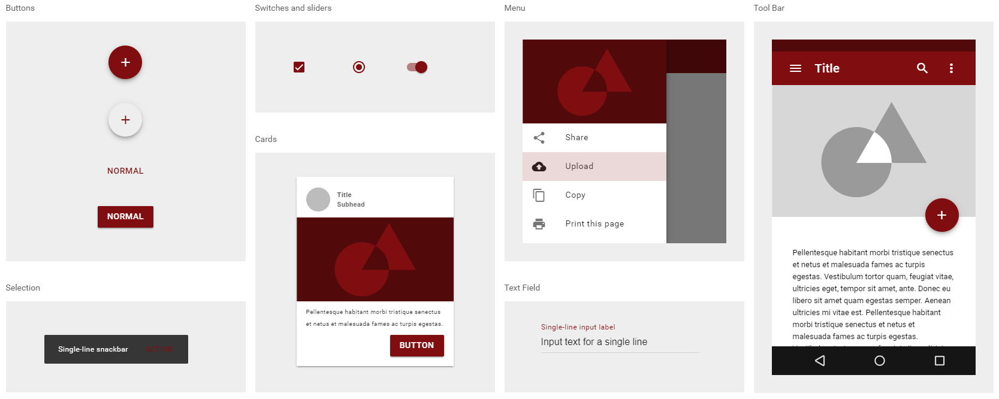
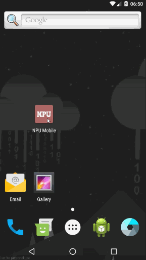
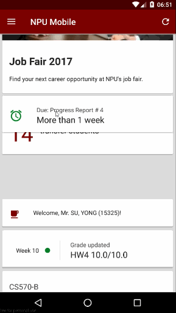
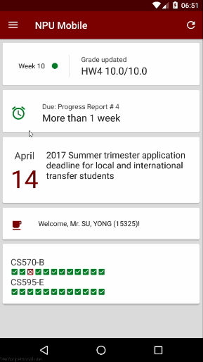

# NPU Mobile

NPU Mobile is the first Android application for Northwestern Polytechnic University students.

## Introduction

NPU Mobile (Android) is a native Android application which provides easier access to [NPU Website](http://www.npu.edu) contents and student portal functions.

## Motivation

Existing website functions well, but with bad User Experience:

* Average 7.3 operations needed for single task
* Students with 12 credits might perform 25 tasks per week
* Approximate 180 operations per week

## Design

### Color Palette

NPU Mobile uses the same primary color as NPU official website

Name|Value
----|-----
colorPrimary|#7D0000
colorPrimaryDark|#4A0000
colorAccent|#007D23
colorPrimaryLight|#932C2C
colorBlack|#212121
colorWhite|#FAFAFA
colorBackground|#DCDCDC

### Icon

NPU Mobile Icon iteration. Final version (rightmost) has the best visibility on smaller screens.

## User Experience

Website contents are available for all users. Student portal functions can only be reached by students with their student ID and password. NPU Mobile encrypts user credentials and send them through log in API to get access to student's portal to unlock all components.

Other than default priority based component sorting, students can manually rearrange components based on their own interests.

Students can remove components from main screen if they are no longer interested in them. These components can be added back in settings.

## Develop

NPU Mobile modularizes informations into components. Each component gets its data by calling corresponding API from [NPU Mobile Server](https://github.com/wynnsu/npu-mobile-server) asynchronously with [Android Asynchronous Http Client](http://loopj.com/android-async-http/). 

The application maintains a [RecyclerView](https://developer.android.com/reference/android/support/v7/widget/RecyclerView.html), components visualize themselves as a [CardView](https://developer.android.com/reference/android/support/v7/widget/CardView.html). Components can be automatically or manually added, removed or rearranged.